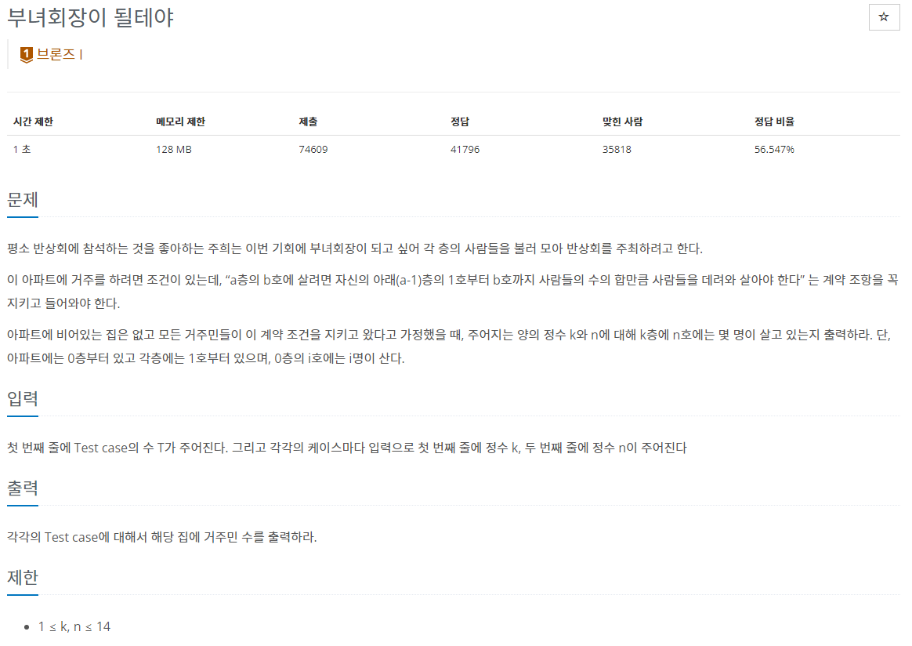

### 백준 2775 부녀회장이 될테야

---



- 이 문제를 풀기 위해서 **재귀함수**라는 함수를 사용하기로 했다

  > **재귀함수** : 끝날 때까지 자기 자신을 호출하는 함수이며 <br>
  > 일반적으로 펙토리얼이 가장 유명하다
  >
- 펙토리얼의 예시 (**꼬리 재귀 함수**.ver)

```java
int factorial(int n,int total) { // int n (원하는 펙토리얼 값, n!), int total (결과 값, 1로 주며 total에 계속 곱해준다.)
    if (n == 1) { // 1! 이 되면 종료
        return total; // 다 곱한 값을 반환
        }
    return factorial(n - 1,n * total);
}
```
